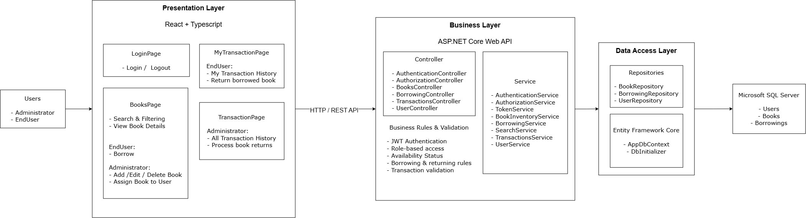

# Library Management System Backend

# Setup and Installation

## Prerequisites

Before running the backend, make sure the following are installed:

- .NET 8 SDK
- Microsoft SQL Server
- Git
- Visual Studio or Visual Studio Code


## 1. Clone the Repository

```bash
git clone <repository-url>
cd <backend-folder>
```

## 2. Configure the Database
Open the appsettings.json file and configure the SQL Server connection string.

```bash
{
  "ConnectionStrings": {
    "DefaultConnection": "Server=<<Server>>;Database=<<Database_Name>>;Trusted_Connection=True;TrustServerCertificate=True;"
  }
}
```

## 3. Configure CORS
The backend is configured to allow requests from the local React development server.

The development CORS policy allows the following frontend origin:

```text
http://localhost:5173
```
The configuration is defined in Program.cs:
```csharp
builder.Services.AddCors(options =>
{
    options.AddPolicy("AllowFrontend", policy =>
    {
        policy
            .WithOrigins("http://localhost:5173")
            .AllowAnyHeader()
            .AllowAnyMethod();
    });
});
```

## 4. Configure User Secrets
The backend uses ASP.NET Core User Secrets to store sensitive development configuration such as JWT settings and database credentials.

Initialize User Secrets for the project:
```bash
dotnet user-secrets init
```
Set the required secrets:
```bash
dotnet user-secrets set "Jwt:Key" "<your-jwt-secret>"
```
If a database connection string is stored as a secret:
```bash
dotnet user-secrets set "ConnectionStrings:DefaultConnection" "<your-connection-string>"
```


## 5. Restore Dependencies and Apply Database Migrations

```bash
dotnet restore
```

Create or update the database using Entity Framework Core migrations
```bash
dotnet ef database update
```
If dotnet ef is not installed, install it with
```bash
dotnet tool install --global dotnet-ef
dotnet ef database update
```

## 6. Trust the HTTPS Development Certificate

The backend uses HTTPS in development.

Check whether the ASP.NET Core HTTPS development certificate is available:

```bash
dotnet dev-certs https --check
```
If the certificate is not trusted, run:
```bash
dotnet dev-certs https --trust
```
This allows the local ASP.NET Core API to run using HTTPS without browser certificate warnings.

## 7. Run the Backend
Start the ASP.NET Core Web API
```bash
dotnet run
```

The API will be available at the URL configured in ```launchSettings.json```.
For example: ```http://localhost:7071```

### Development Mode
To run the backend using the HTTPS launch profile
```bash
dotnet run --launch-profile https
```
The API will be available at the HTTPS URL configured in ```Properties/launchSettings.json```.
For example: ```https://localhost:7071```


## 8. Verify the API
Swagger is enabled, open: ```https://localhost:7071/swagger``` (example URL)


# Technology Stack and Rationale

## C#

C# is used as the primary programming language for the backend.
It provides strong typing, ```object-oriented programming``` features, and good support for building maintainable and structured applications.

## .NET 8

.NET 8 is used as the backend platform for building the Library Management System API.
It provides a ```modern```, high-performance, and ```maintainable``` platform for developing web applications and RESTful APIs.

## ASP.NET Core Web API

ASP.NET Core Web API is used to ```build the RESTful API that handles communication between the frontend and backend```.
It provides built-in support for routing, middleware, dependency injection, authentication, authorization, and HTTP-based APIs.

## Entity Framework Core

Entity Framework Core is used as the ```Object-Relational Mapper (ORM) for database access```.
It allows the application to work with database entities using C# objects and LINQ, while also providing ```migration``` support for managing database schema changes.

## Microsoft SQL Server

Microsoft SQL Server is used as the ```relational database``` for the application.
A relational database is suitable for this system because the application contains structured and related data such as users, books, borrowings, and transaction history.

## JWT Authentication

JSON Web Token (JWT) is used for ```user authentication```.
After successful login, the API issues a JWT that is used to authenticate subsequent requests.

JWT also supports role-based authorization, allowing the system to restrict administrator and EndUser functionality.

## Repository Pattern

The Repository Pattern is used to ```separate database access from business logic```.
Repositories handle data access operations through Entity Framework Core, while services are responsible for business rules.

This improves separation of concerns and makes the code easier to maintain and test.

## Dependency Injection

Dependency Injection is used to ```provide services and repositories to controllers and other components```.
This reduces tight coupling between components and improves maintainability and testability.

## ASP.NET Core User Secrets

ASP.NET Core User Secrets is used during ```development to store sensitive configuration values outside of the source code```.
It can be used for sensitive values such as JWT configuration and database credentials, preventing these values from being committed directly to the source code repository.

## Swagger / OpenAPI

Swagger is used to document and test the ```REST API``` during development.
It provides an interactive ```interface``` for viewing available endpoints, request parameters, and responses.

# Three-Tier Architecture
The system follows a Three-Tier Architecture, clearly separating:
- Presentation Layer
- Business Layer
- Data Access Layer
  


# Assumptions and design decisions

## Separation of Concerns
- Controllers handle HTTP requests and responses.
- Services handle business logic and validation.
- Repositories handle database access.
  
## Dependency Injection
Dependency Injection is used to reduce coupling between controllers, services, and repositories and to improve maintainability and testability.

## Repository Pattern
The Repository Pattern is used to separate database operations from business logic.

Repositories communicate with Entity Framework Core and the database, while services contain the application's business rules.

## Authentication and Authorization

JWT is used for authentication, and role-based authorization is used to control access to administrator and EndUser functionality.

## Book Availability

A book can only be borrowed or assigned when its availability status is `Available`.

The system uses the following book availability statuses:

- Available
- Borrowed
- Lost
- Damaged

## Borrowing and Returning

When a book is borrowed, the system records the borrowing date and due date and updates the book availability status.

When a book is returned, the system records the return date and updates the book availability status to `Available`.

## Transaction History

Borrowing and return records are maintained as historical transactions, including user, book, borrowing date, due date, return date, and transaction status.

## Role Responsibilities

The system supports two roles:

- **Administrator**: Manage books, assign books to users, view transaction history, and process book returns.
- **EndUser**: Search and view books, borrow available books, and view their own transaction history.